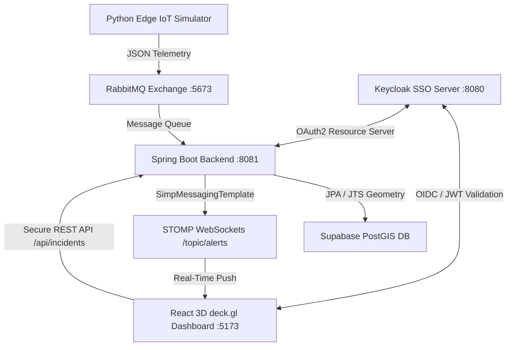

# CampusPulse 🛰️

CampusPulse is a secure, event-driven, 3D spatial twin of the CERN Meyrin campus. It visualizes real-time climate telemetry anomalies ingested from a simulated IoT sensor network, processes the data through a reactive Spring Boot pipeline, stores it in a PostGIS-enabled database, and streams alerts instantly to an interactive 3D WebGL dashboard secured via Single Sign-On (SSO).

---

## 🏗️ Architecture & Data Flow

The complete end-to-end telemetry pipeline operates as follows:



1. **Edge Telemetry**: A Python simulator publishes high-resolution room climate data (CO2, temperature, humidity, motion) with randomized spatial coordinates inside the CERN campus boundaries.
2. **Message Broker**: Messages are published to a Topic Exchange in **RabbitMQ**.
3. **Backend Processor**: A Spring Boot consumer parses incoming telemetry from the queue. If it detects a critical anomaly (`CO2 > 1500 ppm` and active `motion == 1`), it:
   - Instantiates a spatial `Point` using JTS Geometry.
   - Saves the incident natively to a PostgreSQL/PostGIS database hosted on **Supabase**.
   - Broadcasts the incident in real-time over a **STOMP WebSocket** connection.
4. **3D Visualization**: The React frontend (using **deck.gl** and **MapLibre**) renders CERN building footprints extruded into 3D.
5. **SSO & Security**: Users must authenticate via **Keycloak** (OIDC). Outgoing REST calls auto-inject the JWT token via Axios interceptors. On a live alert, the nearest building footprint is calculated programmatically and flashes bright red.

---

## 🛠️ Technology Stack

### Frontend
- **Framework**: React 18, Vite, TypeScript
- **3D Render**: `deck.gl` (GeoJsonLayer with 3D extrusion)
- **Map Viewport**: `maplibre-gl` (Dark-matter basemaps)
- **Authentication**: `react-oidc-context` (OIDC client)
- **Networking**: `axios` (with JWT request interceptors), `@stomp/stompjs` & `sockjs-client` (STOMP over WebSockets)

### Backend
- **Framework**: Spring Boot 3.x, Java 17+
- **Security**: Spring Security OAuth2 Resource Server (Keycloak JWT validation)
- **Database ORM**: Spring Data JPA, Hibernate Spatial, JTS (Java Topology Suite)
- **Integration**: Spring AMQP (RabbitMQ listener), Spring WebSocket (STOMP broker)

### Infrastructure & Simulation
- **Database**: Supabase (PostgreSQL + PostGIS)
- **Identity Provider**: Keycloak (Docker quay.io image)
- **Message Queue**: RabbitMQ Management (Docker image)
- **Simulator**: Python 3, `pika` (RabbitMQ publisher), `pandas`

---

## 🚀 Getting Started

### Prerequisites
Make sure you have the following installed:
- [Docker & Docker Compose](https://www.docker.com/)
- [Java 17 or higher](https://adoptium.net/)
- [Node.js v18+ & npm](https://nodejs.org/)
- [Python 3.x](https://www.python.org/)

---

### Step 1: Spin Up Infrastructure (Docker)
In the root directory, start the local Keycloak and RabbitMQ containers:
```bash
docker compose up -d
```
* **Keycloak**: Running on `http://localhost:8080` (Realm: `campuspulse`, Client: `frontend-client`)
* **RabbitMQ**: AMQP Broker on `localhost:5673`, Management Console on `http://localhost:15673` (user: `guest`, pass: `guest`)

---

### Step 2: Set Up Supabase PostGIS Database
1. Create a PostgreSQL project on Supabase.
2. In the Supabase SQL Editor, enable PostGIS and set up the schema:
   ```sql
   -- Enable Spatial database support
   CREATE EXTENSION IF NOT EXISTS postgis;

   -- Create incidents table
   CREATE TABLE incidents (
       id SERIAL PRIMARY KEY,
       description TEXT,
       co2_level DOUBLE PRECISION,
       location GEOMETRY(Point, 4326)
   );

   -- Create spatial index for fast distance queries
   CREATE INDEX idx_incidents_location ON incidents USING gist(location);

   -- Enable Row Level Security (RLS)
   ALTER TABLE incidents ENABLE ROW LEVEL SECURITY;
   ```
3. Configure your database connection in `backend/src/main/resources/application.properties`:
   ```properties
   spring.datasource.url=jdbc:postgresql://<YOUR_SUPABASE_HOST>:5432/postgres
   spring.datasource.username=postgres
   spring.datasource.password=<YOUR_SUPABASE_PASSWORD>
   ```

---

### Step 3: Run the Spring Boot Backend
1. Navigate to the backend folder:
   ```bash
   cd backend
   ```
2. Compile and run the server:
   ```bash
   ./mvnw spring-boot:run
   ```
The backend starts on `http://localhost:8081`.

---

### Step 4: Run the React Dashboard
1. Navigate to the frontend folder:
   ```bash
   cd ../frontend
   ```
2. Install dependencies:
   ```bash
   npm install
   ```
3. Run the Vite development server:
   ```bash
   npm run dev
   ```
Open `http://localhost:5173` in your browser. You will be redirected to the Keycloak SSO screen. Log in using your configured credentials (e.g. username `test` and password `test`).

---

### Step 5: Start the Telemetry Stream
1. Navigate to the simulator folder:
   ```bash
   cd ../simulator
   ```
2. Install Python dependencies:
   ```bash
   pip install -r requirements.txt
   ```
3. Run the telemetry generator:
   ```bash
   python3 generate_telemetry.py
   ```
The Python script will stream logs from `oulu_telemetry.csv`, assign random coordinates within the CERN Meyrin campus bounding box, and publish them to RabbitMQ. Watch your React dashboard update in real-time as anomalies occur!
